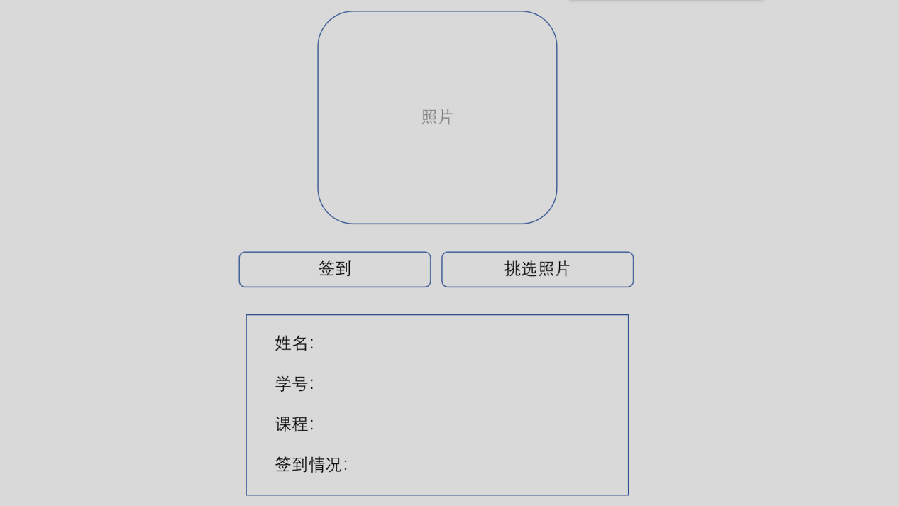

## 软件功能结构

### 签到界面

照片有两个来源。先做第一个，做出雏形，在完成摄像头获取照片的功能后做出第二个。
1. 从本地选择照片。点击“挑选照片”，选择照片后在照片框显示照片并对照片进行识别，识别得到一个照片标识，将标识传给签到模块进行签到，得到签到信息，并在下方显示签到信息。
2. 从摄像头获取照片。照片框动态显示摄像头所拍摄照片，点击“签到”，从摄像头获取照片后锁定图片，对照片进行识别识别得到一个照片标识，将标识传给签到模块进行签到，得到签到信息，并在下方显示签到信息。
### 教师管理页面（网页实现）
老师用，通过职工号，密码登陆。老师可以查看自己所教课程的签到信息。根据年级、专业、班级、课程、学号等信息进行筛选所查看数据，以表格形式显示
### 后台管理页面（网页实现）
管理员使用，通过账号密码登陆。最后实现。
### 识别模块
需要实现的主要功能：接收一张图片，调用Face++的Search
API进行识别，识别结果会得到一个标识码。
需要实现与face++ search api交互的所有功能。
Face++ API文档：
https://console.faceplusplus.com.cn/documents/4888381
### 签到模块
接收标识码，对比数据库确认学生信息；通过当前时间和数据库中的课程安排表信息，确认当前所上的课程。确认学生信息和课程后，判断学生这节课是否已经签到，若已签到，忽略；若未签到，将签到信息添加到数据库签到表。该模块会返回签到信息，包括(1)是否签到成功(2)学生姓名(3)学生学号(4)所签到课程(5)若签到未成功，原因是什么。
### 数据库交互
封装与数据库的交互功能。每一个表都是一个数据表类的子类，封装了数据库连接，及增删改查的功能。
## 数据库设计
使用MySQL数据库。

### 学生表(Student)

| 属性名     | 储存代码 | 类型      | 备注                       |
| ---------- | -------- | --------- | -------------------------- |
| 姓名       | Sname    | char(20)  |                            |
| 学号       | Snum     | char(20)  | 主码                       |
| 班级       | Sclass   | char(20)  | 班级表外码                 |
| 性别       | Sex      | char(3)   | 限制男、女这两个值         |
| 识别标识符 | Sid      | char(100) | 与face++中的照片标识码匹配 |

### 教师表(Teacher)

| 属性名 | 储存代码 | 类型     | 备注             |
| ------ | -------- | -------- | ---------------- |
| 姓名   | Tname    | char(20) |                  |
| 职工号 | Tnum     | char(20) | 主码             |
| 性别   | Tsex     | char(3)  | 限定男、女两个值 |

### 专业表(Major)

| 属性名   | 储存代码 | 类型     | 备注 |
| -------- | -------- | -------- | ---- |
| 专业名   | Mname    | char(50) |      |
| 专业代码 | Mnum     | char(20) | 主码 |

### 班级表(Class)

| 属性名   | 储存代码 | 类型     | 备注       |
| -------- | -------- | -------- | ---------- |
| 班号     | Cname    | tinyint  | 几班       |
| 班级代码 | Cnum     | char(20) | 主码       |
| 所属专业 | Cmajor   | char(20) | 专业表外码 |

### 课程表(Course)

| 属性名     | 储存代码 | 类型     | 备注       |
| ---------- | -------- | -------- | ---------- |
| 课程名     | Rname    | char(50) |            |
| 课程代码   | Rnum     | char(20) | 主码       |
| 班级       | Rclass   | char(20) | 班级表外码 |
| 任课老师   | Rteacher | char(20) | 教师表外码 |
| 应签到次数 | Rsign    | int      | 默认为0    |

### 签到表(SignIn)

| 属性名 | 储存代码 | 类型     | 备注           |
| ------ | -------- | -------- | -------------- |
| 课程头 | Garrange | int      | 课程安排表外码 |
| 学号   | Gstudent | char(20) | 学生表外码     |

### 课程安排表(Arrange)

| 属性名   | 储存代码 | 类型     | 备注                     |
| -------- | -------- | -------- | ------------------------ |
| 课程头   | Aid      | int      | 主码                     |
| 课程代码 | Acourse  | char(20) | 课程表外码               |
| 周数     | Aweek    | int      | 哪一周上课               |
| 星期     | Aday     | int      | 哪一天上课，限定值为1\~7 |
| 上课时间 | Atime    | Int      | 第几节上课，限定值为1\~5 |

## 每个部分的分工
1. 签到界面：张欣蓓
2. 教师管理页面：刘旭
3. 识别模块：王浩博
4. 签到模块：朱靖娴、张砺心
5. 数据库交互：刘克楠、刘旭


## 需要安装的软件

如果已经安装MySQL就不需要装前两个了,下载的时候用迅雷下载比较快

1.  Python 2.7(32-bit): https://www.python.org/ftp/python/2.7.15/python-2.7.15.msi
2.  MySQL 8.0(32-bit): https://cdn.mysql.com//Downloads/MySQLInstaller/mysql-installer-community-8.0.11.0.msi
3.  JDK1.8: http://download.oracle.com/otn-pub/java/jdk/8u181-b13/96a7b8442fe848ef90c96a2fad6ed6d1/jdk-8u181-windows-x64.exe?AuthParam=1532569162_f6458cf6d3841e41e9a0bf8e646c66c1
4.  Eclipse: http://mirrors.neusoft.edu.cn/eclipse/technology/epp/downloads/release/photon/R/eclipse-java-photon-R-win32-x86_64.zip

## 配置方法

1.  **下载源代码**

    点“Clone or Download”

    

    选择“Download ZIP”，下载源代码的压缩包

    

2.  **解压缩**

    右键点击刚下载的压缩包，在弹出的菜单里选择“全部解压缩”

    

    解压缩后得到一个文件夹，点进去

    

    点进去后还有一个名字一模一样的文件夹，记住这个文件夹，之后要用

    

3.  **将源代码导入Eclipse**

    打开Eclipse，点击菜单栏的“File”，选择“Open Projects from File System”

    

    弹出来的对话框中选择“Directory”，

    

    选择后点“Finish”

    

    这就将源代码导入了Eclipse

4.  **导入额外的包**

    将源代码导入Eclipse后，点菜单栏的"Project"，选"Properties"

    

    按照下图中的顺序操作，点击“Add JARs”

    

    在弹出的窗口中选下图这个.jar文件，然后点”OK“

    

    之后会回到刚才的界面，点”Apply and close“完成配置

    


## 开发规范

### 命名规范
1. 类名所有每个单词的首字母大写。
例如：`People`, `Student`等
2.  变量及函数名第一个单词首字母小写写，其他首字母大写。
例如：`userName`, `password`, `getUserByName(String userName)`
3.  静态常量字段(static final)全部采用大写字母，单词之间用下划线分割。
例如：`MIN_BALANCE`, `PI`
4.  避免使用类似名字，或者仅仅是大小写不同。
5.  如果变量是集合，则变量名应用复数。
例如：`int[] students`
### 注释
每个类、函数必须有注释说明，这些注释全部写在类和函数定义之前。注释格式如下：
#### 类注释
```java
/*
 * 类的说明
 * @author: 作者
 * */
Class classname{ ... }
```
示例：
```java
/*
 * 所有表类的父类，封装数据库操作。
 * @author: 刘旭
 * */
Abstract class Database{...}
```
#### 函数注释
```java
/*
 * 函数功能说明
 * @param: 参数名称1: 参数解释
 * @param: 参数名称2: 参数解释
 * @return 返回值解释
 * @author: 作者
 * */
```
示例：
```java
/*
 * 根据标识码签到
 * @param: idCode: 照片的标识码
 * @return:
 * 返回签到信息，包括(1)是否签到成功(2)学生姓名(3)学生学号(4)所签到课程(5)若签到未成功，原因是什么。
 * @author: 朱靖娴
 * */
HashMap <String, Object> sign(String idCode){...}
```
## 各部分必须提供的接口

1.  签到界面：
无
2. 教师管理页面：
无
3. 识别模块：
```java
String recognition(byte[] imgByte)

@param: imgByte 图片的二进制形式
@return: 所匹配图片的标识
```
4. 签到模块：
```java
HashMap <String, Object> sign(String idCode)

@param: idCode 照片识别码
@return: 签到信息,包括
1. 是否签到成功, ”status”:int
2. 学生姓名, “studentName”:String
3. 学生学号, “studentNum”:String
4. 所签到课程, “courseName”:String
5.  若签到未成功，原因是什么, “problem”:int
```
5. 数据库交互：

   太多了，我不想写。